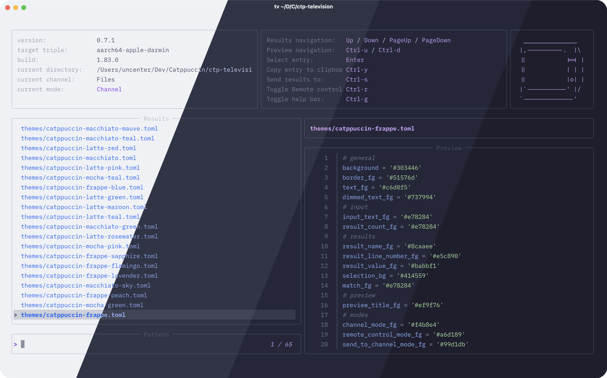
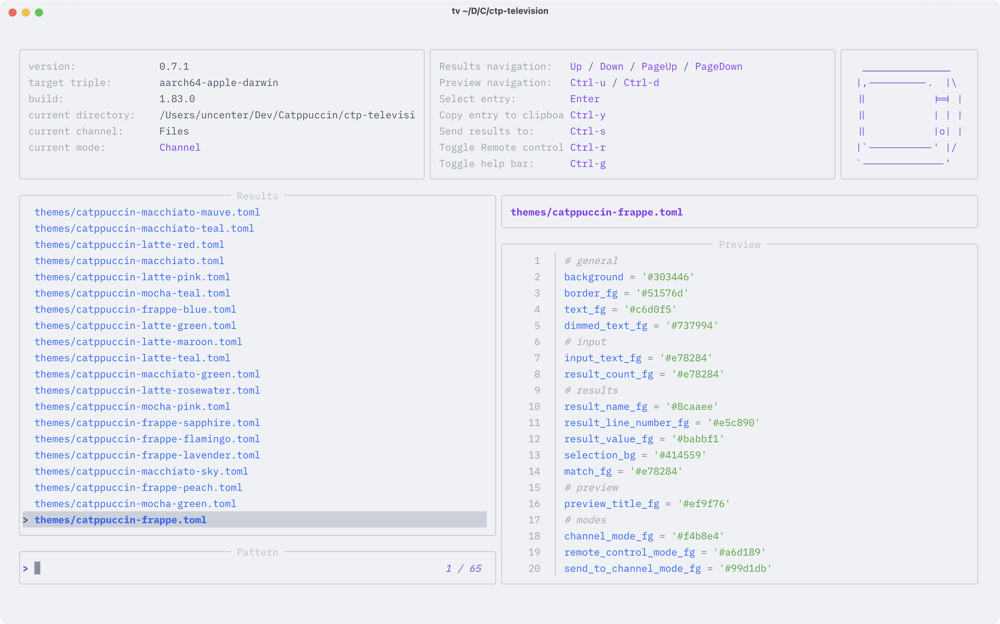
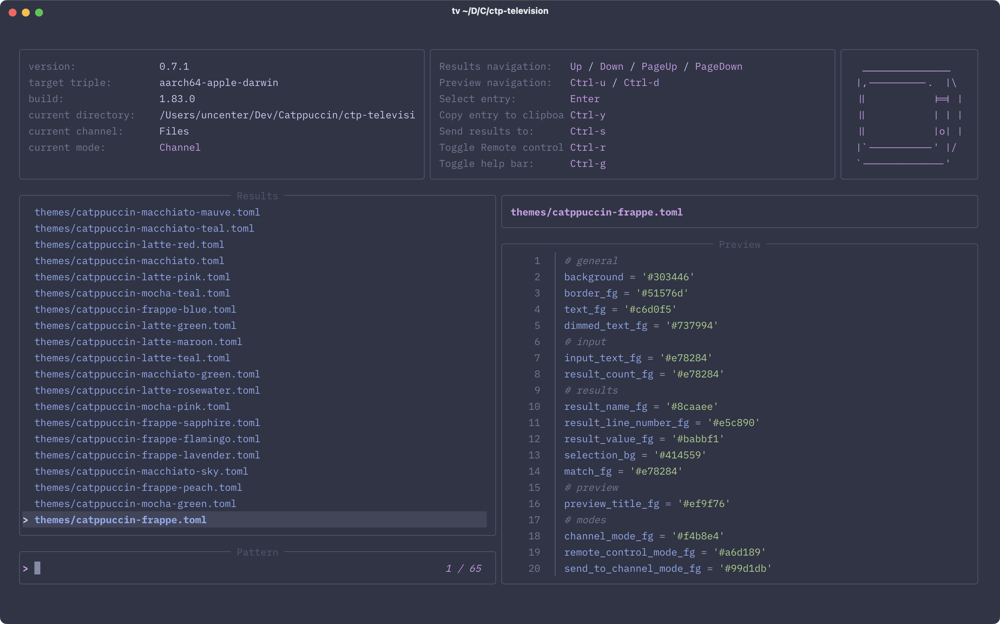

<h3 align="center">
	<br/>
	
	Catppuccin for <a href="https://github.com/alexpasmantier/television">television</a>
	
</h3>

<p align="center">
	<a href="https://github.com/catppuccin/television/stargazers"></a>
	<a href="https://github.com/catppuccin/television/issues"></a>
	<a href="https://github.com/catppuccin/television/contributors"></a>
</p>

<p align="center">
	
</p>

## Previews

<details>
<summary>🌻 Latte</summary>

</details>
<details>
<summary>🪴 Frappé</summary>

</details>
<details>
<summary>🌺 Macchiato</summary>

</details>
<details>
<summary>🌿 Mocha</summary>

</details>

## Usage

1. Download your preferred flavor and accent combination from [`themes/`](./themes/).
2. Move the downloaded file to the `themes/` folder of your television configuration directory (see https://github.com/alexpasmantier/television/blob/main/README.md#configuration).
3. Add the following to your television configuration file (`config.toml`), replacing `<flavor>` and `<accent>` with the flavor and accent you chose.

```toml
[ui]
theme = "catppuccin-<flavor>-<accent>.toml"
```

In other words, the value of the `ui.theme` key should match the filename of the file downloaded previously.

4. If you have a [catppuccin/bat](https://github.com/catppuccin/bat) theme installed, add the following again to your television configuration file:

```toml
[previewers.file]
theme = "Catppuccin <flavor>"
```

Where `<flavor>` is the name of the catppuccin/bat flavor you would like to use, such as "Mocha".

## Contributing

This repository uses [Whiskers](https://github.com/catppuccin/whiskers) to generate theme files. Edit the `television.tera` template, and run either `whiskers television.tera` or `just build` (if you have [just](https://github.com/casey/just) installed) to update the files in `themes/`.

## 💝 Thanks to

- [uncenter](https://github.com/uncenter)

&nbsp;

<p align="center">
	
</p>

<p align="center">
	Copyright &copy; 2021-present <a href="https://github.com/catppuccin" target="_blank">Catppuccin Org</a>
</p>

<p align="center">
	<a href="https://github.com/catppuccin/catppuccin/blob/main/LICENSE"></a>
</p>
